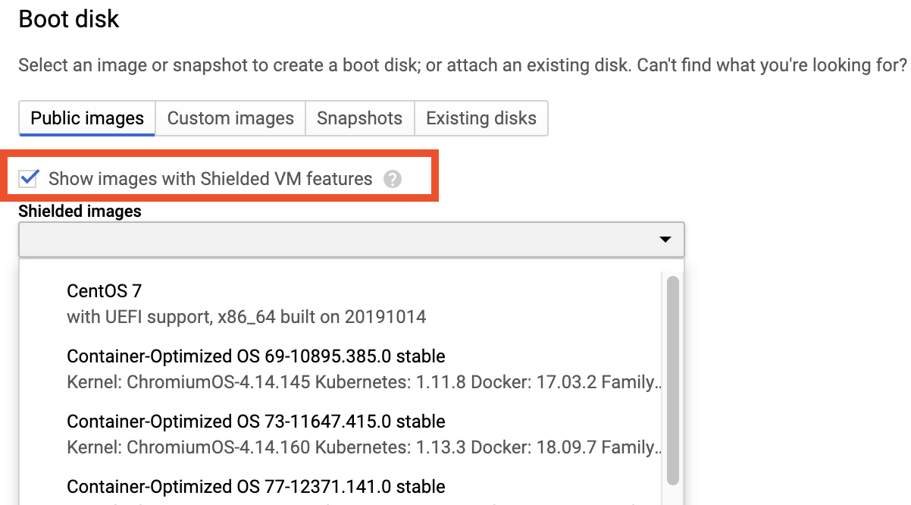

# Secure GCE

When launching 

### 1. **Use a Compute Service Account that has only the permissions you need.**

1. [https://cloud.google.com/compute/docs/access/service-accounts](https://cloud.google.com/compute/docs/access/service-accounts)
2. “The Compute Engine default service account is created with the IAM project editor role, but you can modify the service account's roles to securely limit which Google APIs the service account can access.”
3. Consider a “user managed service account” with a fresh service account used just for your GCEs. No need to create a key.

### 2. Use a managed network with a subnet.

Scroll to the bottom and click "Management, security, disks, networking, sole tenancy". Select the "Networking" tab. Use a Network tag to set the firewall rules for the instance.

### 3. Use only [CIS hardened images](https://console.cloud.google.com/marketplace/browse?q=CIS) or Shielded VM images for your boot disk \(or create your own hardened image\).

For GCE Image, use \(if your use-case allows -- for sensitive data like PII only. This is overkill for De-ID’d and non-sensitive data. Only use for Broad Classification.

Use your own image and harden it to an official standard like CIS or NIST

Pre-made scripts to auto do this are here: https://github.com/dev-sec

### 4. Use Google IAM for SSH Access

If a user needs access to a Compute Engine instance, add them to the subnet's IAM policy with a role with the minimum necessary permissions.

`gcloud compute networks subnets add-iam-policy-binding ([SUBNETWORK] : --region=[REGION]) --member='user:[USER]@broadinstitute.org' --role='roles/compute.instanceAdmin.v1'`

#### Additional Reading for Compute Engine IAM

* [https://cloud.google.com/compute/docs/instances/managing-instance-access](https://cloud.google.com/compute/docs/instances/managing-instance-access)
* [https://cloud.google.com/compute/docs/access/granting-access-to-resources](https://cloud.google.com/compute/docs/access/granting-access-to-resources)

## Production/Sensitive Data Requirements

### 1. Make sure OS automatic updates are on.

* Centos - [https://serversforhackers.com/c/automatic-security-updates-centos](https://serversforhackers.com/c/automatic-security-updates-centos) 
* Ubuntu - [https://help.ubuntu.com/lts/serverguide/automatic-updates.h](https://help.ubuntu.com/lts/serverguide/automatic-updates.html.en)

### 2. Set up logging on your VM.

VM logs should use StackDriver and SIEM. See [https://cloud.google.com/logging/docs/agent/installation](https://cloud.google.com/logging/docs/agent/installation) for installation instructions.

1. System logs are picked up by default.
2. Application logs should write to a file that gets picked up by StackDriver.
3. Contact BITS about having logs go to a SIEM

#### Additional Reading

* [https://cloud.google.com/logging/docs/agent/configuration](https://cloud.google.com/logging/docs/agent/configuration)

