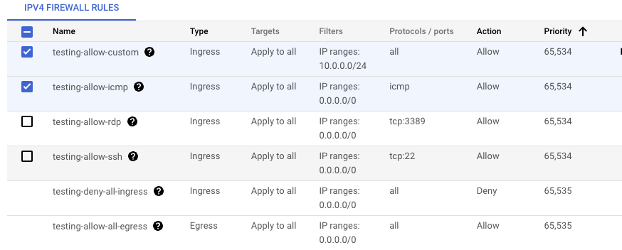

# Securing the Network

## Access your GCE through SSH or RDP

1.  Create a network:

    `gcloud compute networks create [NETWORK-NAME]`
2.  Create a subnet:

    `gcloud compute networks subnets create [SUBNET-NAME] --network=[NETWORK-NAME] --enable-flow-logs --range=10.100.1.0/24`

We recommend using the `[NETWORK-NAME]-subnet` format for your subnet name. You may also want to change the range for your subnet, but please talk to BITs when creating a unique range.

If you choose to do this in the GUI, **DON'T** select `*-allow-rdp` or `*-allow-ssh` Firewall Rules during the creation of the VPC network as shown below.&#x20;

<figure><figcaption></figcaption></figure>

_**Note: You don't need to create the ssh/rdp firewall rules as this has been done for you already.**_

3. [Enable OS Login -](https://cloud.google.com/compute/docs/oslogin/set-up-oslogin#enable\_os\_login) This simplifies SSH access management by linking your Linux user account to your Google identity. This does not have to be enabled if you are using RDP
4.  Create your GCE and attached it to the created subnetwork&#x20;

    ```
    gcloud compute instances create VM_NAME \
      --network=NETWORK_NAME \
      --subnet=SUBNET_NAME \
      --zone=ZONE
    ```
5.  [Grant the user account ](https://cloud.google.com/iam/docs/granting-changing-revoking-access#iam-grant-single-role-console)that needs to access the GCE with the following permissions:

    * `Compute Admin`
    * `Compute OS login`(We recommend enabling OS login on the project/VM)
    * `IAP-Secured Tunnel User`

    **Optional**: `Service account user` on the service account running your VM ( Only used if the VM being access is running with a service account - DO NOT to use the default service accounts)

You can then access your machine using either of these options:

1. SSH access
   * In-console ssh (GUI SSH button)
   * In-console cloud shell using the command `gcloud compute ssh --zone [zone] [instance] --project [project_name] --tunnel-through-iap`
   * Local (Your computer’s) terminal without VPN into Broad using the command `gcloud compute ssh --zone [zone] [instance] --project [project_name] --tunnel-through-iap`
   * Local (Your computer’s)  terminal while VPN'ed into Broad using the command `gcloud compute ssh --zone [zone] [instance] --project [project_name]`
2. RDP access - [Review Google's documentation on Tunneling RDP connections](https://cloud.google.com/iap/docs/using-tcp-forwarding#iap-desktop\_1)

## Creating Firewall Rules for any other access

### 1. Create a Firewall Rule

Firewall rules refer to either incoming (ingress) or outgoing (egress) traffic. You can target certain types of traffic based on its protocol, ports, sources, and destinations.

* Be REALLY mindful when creating new rules.
* If you want to alter the range of ports, [update the current rule](https://cloud.google.com/vpc/docs/using-firewalls#updating\_firewall\_rules) rather than create a new one.
* It is recommended to use the network in the rule's name.

```
gcloud compute firewall-rules create NAME \
    [--network NETWORK; default="default"] \
    [--priority PRIORITY;default=1000] \
    [--direction (ingress|egress|in|out); default="ingress"] \
    [--action (deny | allow )] \
    [--target-tags TAG,TAG,...] \
    [--target-service-accounts=IAM Service Account,IAM Service Account,...] \
    [--source-ranges CIDR-RANGE,CIDR-RANGE...] \
    [--source-tags TAG,TAG,...] \
    [--source-service-accounts=IAM Service Account,IAM Service Account,...] \
    [--destination-ranges CIDR-RANGE,CIDR-RANGE...] \
    [--rules (PROTOCOL[:PORT[-PORT]],[PROTOCOL[:PORT[-PORT]],...]] | all ) \
    [--disabled | --no-disabled]
    [--enable-logging | --no-enable-logging]       
```

Look at the [docs for Firewall rules](https://cloud.google.com/vpc/docs/using-firewalls#creating\_firewall\_rules) to learn more about creating firewal rules

### 2. Firewall Rule Targets

Every firewall rule in Google Cloud must have a [target](https://cloud.google.com/vpc/docs/firewalls#rule\_assignment) which defines the instances to which it applies. The default target is _**all instances in the network**_**,** but you can specify instances as targets using either target tags or target service accounts.

:closed\_lock\_with\_key:We **strongly recommend** using target tags or service accounts to narrow the scope of the firewall rules created. To learn more review this [Google KB](https://cloud.google.com/vpc/docs/add-remove-network-tags#targets\_for\_firewall\_rules).

The following example will enable all Broad users on VPN or at a Broad office to contact all machines tagged with `broad-allow` in the network on port 6677 but be blocked to the rest of the world. `broad-allow` is our target tag. You can use any word or combination of words with hypens for target tags.

```
gcloud --project --account compute firewall-rules create [RULES-NAME] \
    --allow=tcp \ # could also use tcp:6677
    --target-tags broad-allow \ 
    --network=[NETWORK-NAME] \
    --source-ranges=69.173.64.0/19,69.173.96.0/20,69.173.112.0/21,69.173.120.0/22,69.173.124.0/23,69.173.126.0/24,69.173.127.0/25,69.173.127.128/26,69.173.127.192/27,69.173.127.240/28 \
    --enable-logging
```

:closed\_lock\_with\_key:The service account you attached to your instance is what is used as the target tag. We recommend that the permissions given to this service account f[ollow the rule of least priviledge](https://cloud.google.com/iam/docs/using-iam-securely).&#x20;
