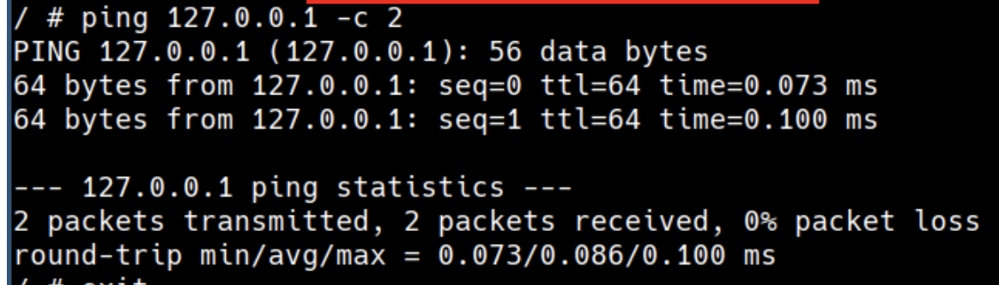
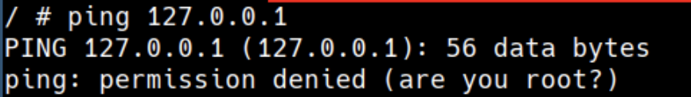

# Capabilities

#### Capabilities

Capabilities turn the binary "root/non-root" into a fine-grained access control system. Processes (like web servers) that just need to bind on a port below 1024 do not have to run as root, they can just be granted the `net_bind_service` capability instead.

> Starting with kernel 2.2, Linux divides the privileges traditionally associated with superuser into distinct units, known as capabilities, which can be independently enabled and disabled.

```
docker run --rm -it alpine sh

# run ping command in a container
ping 127.0.0.1 -c 2
```



Removing the capabilities ..

```
# Removing the capabilities
docker run --rm -it --cap-drop=NET_RAW alpine sh
```


