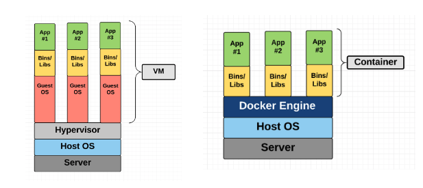
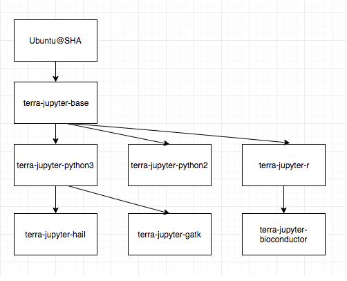

# Introduction

## Objective

The purpose of the document is to explain the security concerns associated with the use of Docker containers in **Firecloud/Terra** and make practical recommendations for addressing those concerns when planning for, implementing, and maintaining containers

## Introduction

### **Security in Docker Containers vs VMs**

One of the many misconceptions on the difference between Docker containers vs VMs is that Docker are actually more secure in terms of preventing some malicious code from affecting other machines, compared to virtual machines or bare metal.   
In general, the security of a virtual machine is better than that of a container. To break through the virtual machine to a host or other virtual machine, it is extremely difficult to break through the hypervisor layer. The docker container shares the kernel, file system and other resources with the host, and is more likely to affect other containers and hosts. If someone exploits a kernel bug inside a container it exploits it in the host OS. If this exploit allows for code execution, it will be executed in the host OS, not inside the containers. This is a process that would be much harder and longer in a VM where an attacker would have to exploit both the VM kernel, the hypervisor and the host kernel. ****

### **Docker in Firecloud/Terra**

FireCloud is built on top of the Google Cloud Platform, relying on the Google Identity Platform for user authentication and authorized access to Google APIs, Google Cloud Storage \(GCS\) for data storage and Google Genomic’s Pipelines API \(PAPI\) for the running of docker containers on Google Compute Engine \(GCE\) VM instances.  Leo gives users control over the docker image that they use to run interactive analysis promoting reproducible science. This means that users have the ability to customize their environment if they with and access to an image containing BioConductor packages.

