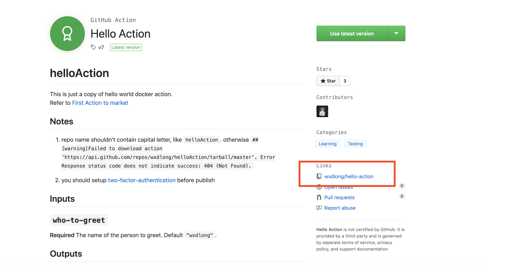
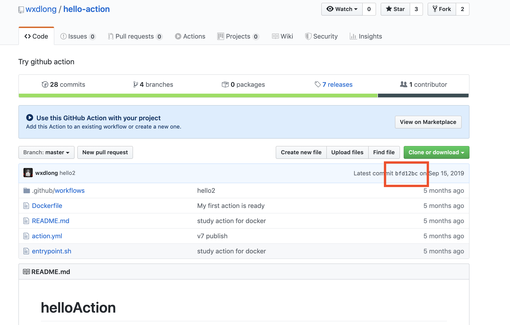
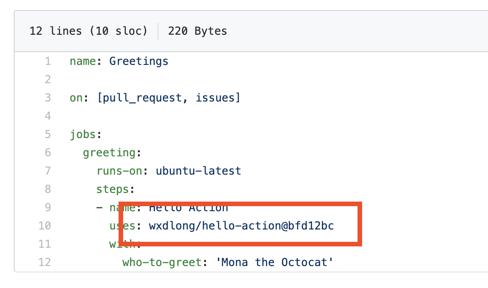

# Github Actions

Generally, we prefer using internal workflows for Github Actions. If you want to use an action on the Github Marketplace, make sure to verify the action is safe and then pin the action's version to your workflow using the commit hash. If you are not sure whether a third-party action is secure, please consult the Application Security team.

### 1. Go to the third party Action's repo.

### 2. Verify that the source code is secure, and find the commit hash for that version.

### 3. Use the commit hash to specify the third party action's version in your workflow.

