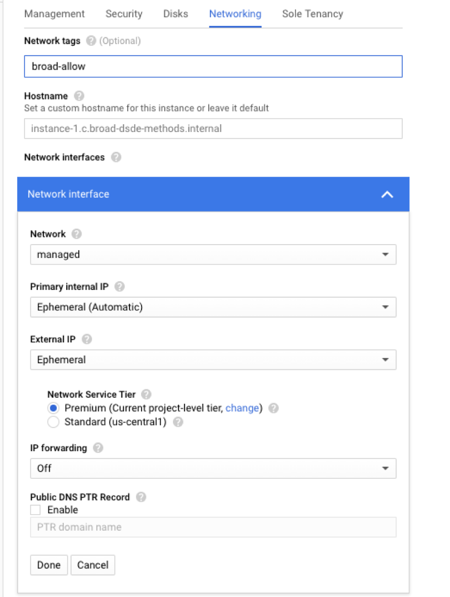

# Secure GCE

1. Use a managed network with a subnet!
    i. **Use a tag to manage which FW rule has access to the machine!**
    
2. Use either 
  i. CIS Hardened Images: [https://www.cisecurity.org/cis-hardened-images/google/](https://www.cisecurity.org/cis-hardened-images/google/)
  ii. Use Shielded VMs: [https://cloud.google.com/shielded-vm/](https://cloud.google.com/shielded-vm/)

3. Only use Google’s IAM for SSH access. i. Give users “compute” access to specific Subnets as opposed to the whole project via Google IAM: [https://cloud.google.com/compute/docs/instances/managing-instance-access](https://cloud.google.com/compute/docs/instances/managing-instance-access) ii. [https://cloud.google.com/compute/docs/access/granting-access-to-resources](https://cloud.google.com/compute/docs/access/granting-access-to-resources) iii. Example of granting access for a user to SSH to machines in a specific subnet:

   `gcloud compute subnetwork add-iam-policy \ \| --member='user:user@gmail.com' \ \| --role='roles/compute.instanceAdmin.v1`

4. Your VM should have some things on \(required only if your VM has access to Production data\): 
    i. Make sure auto-update of security patches is on:
       * Centos - [https://serversforhackers.com/c/automatic-security-updates-centos](https://serversforhackers.com/c/automatic-security-updates-centos) 
       * Ubuntu - [https://help.ubuntu.com/lts/serverguide/automatic-updates.html.en](https://help.ubuntu.com/lts/serverguide/automatic-updates.html.en)
5. \(advanced\) Logs should go somewhere \(required only if your VM has access to Production data\) 
    i. VM logs should use StackDriver and go out to there.
      * [https://cloud.google.com/logging/docs/agent/installation](https://cloud.google.com/logging/docs/agent/installation)
      * By default, it picks up system logs
      * For applications: application can write to a file that gets picked up by Stackdriver \(like /var/log/applicationname\) via the fluentd agent
      * [https://cloud.google.com/logging/docs/agent/configuration](https://cloud.google.com/logging/docs/agent/configuration)
    ii. See BITS about having traffic of logs go to SIEM.
      * By default all “Google” logs already go to SIEM - this is just for the application/OS.