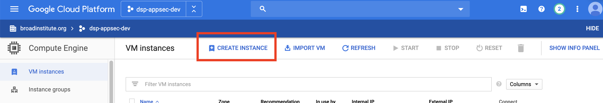
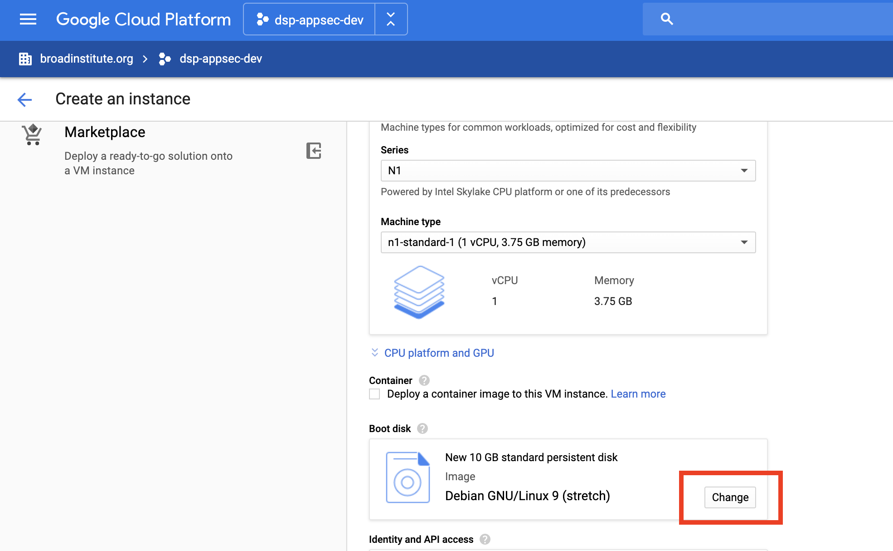
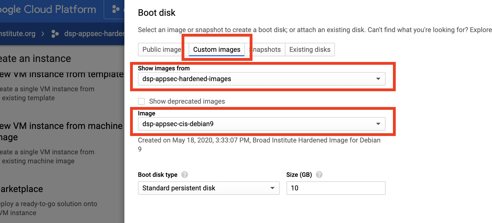

# OS Base Hardening

## 1. Use a dsp-appsec custom image

### Prerequisites:

* `roles/compute.imageUser` permissions from dsp-appsec
  * All active Broadies should have permission by default
  * dsp-appsec will need your Google APIs service account to grant your project permission to use the images. This service account can be found in the IAM section of your project and is in the form `[PROJECT_NUMBER]@cloudservices.gserviceaccount.com`

DSP has pre-configured images that are hardened according to CIS benchmarks. You can start an instance based on an image using `gcloud` or the GCP console, using the deployment manager, or using the GCP console. The images are stored in the `dsp-appsec-hardened-images` GCP project, on which all Broadies have image user permissions.

### A. gcloud command

```
gcloud compute instances create [INSTANCE_NAME] \
    --image [IMAGE] \
    --image-project dsp-appsec-hardened-images
```

### B. Deployment Manager

You can also use Google's deployment manager to manage the instance for you. Use the configuration file `example.yaml` template below to specify the properties of your instance.

N**ote**: You may need to change zone, network, or machine type properties for your project.

```yaml
resources:
- type: compute.v1.instance
  name: [INSTANCE NAME]
  properties:
    zone: us-central1-f
    machineType: https://www.googleapis.com/compute/v1/projects/[YOUR-PROJECT]/zones/us-central1-f/machineTypes/f1-micro
    disks:
    - deviceName: boot
      type: PERSISTENT
      boot: true
      autoDelete: true
      initializeParams:
        sourceImage: https://www.googleapis.com/compute/v1/projects/dsp-appsec-hardened-images/global/images/[CIS-IMAGE]
    networkInterfaces:
    - network: https://www.googleapis.com/compute/v1/projects/[YOUR-PROJECT]/global/networks/default
      accessConfigs:
      - name: External NAT
        type: ONE_TO_ONE_NAT
```

You can then deploy the instance using the command

```
gcloud deployment-manager deployments create [DEPLOYMENT-NAME] --config example.yaml
```

### C. Console

You can click on the instance in the GCP console and click the "Create Instance" button at the top of the page.



Name your instance and set any other properties before scrolling down to Boot disk. Click the **Change** button.



You can then go to custom images and select `dsp-appsec` as your project before choosing an image.



dsp-appsec currently has the following images:

* `dsp-appsec-cis-debian9`

## 2. Use dsp-appsec's ansible playbook for CIS hardening

To run CIS hardening via ansible, clone this repo and call the script. The script will automatically install all the requirements and run the playbook in a virtual environment.

### Prerequisites:

* ssh access to the compute instance
* git installed

Make sure to replace the `[OS]` below with your system.

Currently, supported systems include:

* `debian9`

```
git clone https://github.com/broadinstitute/dsp-appsec-base-image-hardening.git

dsp-appsec-base-image-hardening/[OS]/harden-images.sh
```

Click [here](https://github.com/broadinstitute/dsp-appsec-base-image-hardening) for the Github repo.

You can also use dsp-appsec ansible roles in your custom ansible playbook:

* [Debian 9](https://github.com/broadinstitute/dsp-appsec-debian9-hardening-role)
