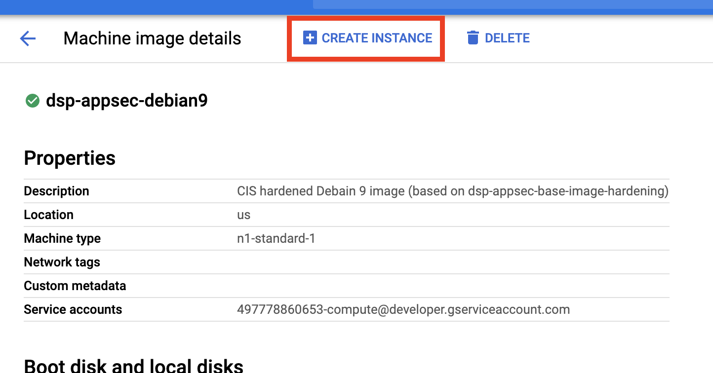
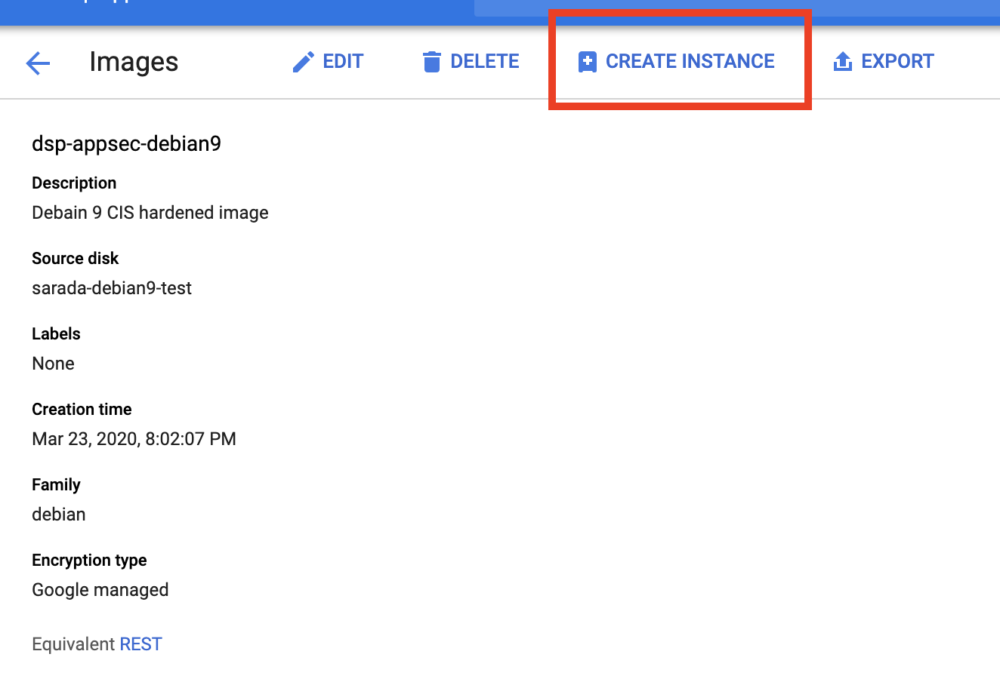

# OS Base Hardening

## Option A: Use a dsp-appsec machine image

DSP has pre-configured machine images that are hardened according to CIS benchmarks. Machines instances include additional security features such as the default DSP secure network and pre-set IAM permissions. You can start an instance based on a machine image using `gcloud` or the GCP console.

```text
gcloud beta compute instances create [YOUR-NEW-INSTANCE-NAME] \
    --zone [ZONE] \
    --source-machine-image [MACHINE-IMAGE-NAME]
```

You can also click on the machine instance in the GCP console and click the "Create Instance" button at the top of the page.



You can find a list of hardened machine images here \[TBD\].

## Option B: Use a dsp-appsec custom image

DSP has pre-configured images that are hardened according to CIS benchmarks. You can start an instance based on an image using `gcloud` or the GCP console. 

```text
gcloud compute instances create [INSTANCE_NAME] \
    --image [IMAGE] \
    --image-project dsp-appsec-prod
```

You can also click on the instance in the GCP console and click the "Create Instance" button at the top of the page.



You can find a list of hardened images here \[TBD\].

## Option C: Use dsp-appsec's ansible playbook for CIS hardening

To run CIS hardening via ansible, clone this repo and call the script. The script will automatically install all the requirements and run the playbook in a virtual environment.

Make sure to replace the `[OS]` below with your system.

Currently, supported systems include:

* `debian9`

```text
git clone https://github.com/broadinstitute/dsp-appsec-base-image-hardening.git

dsp-appsec-base-image-hardening/[OS]/harden-images.sh
```

Click [here](https://github.com/broadinstitute/dsp-appsec-base-image-hardening) for the Github repo.

You can also use dsp-appsec ansible roles in your custom ansible playbook:

* [Debian 9](https://github.com/broadinstitute/dsp-appsec-debian9-hardening-role)

